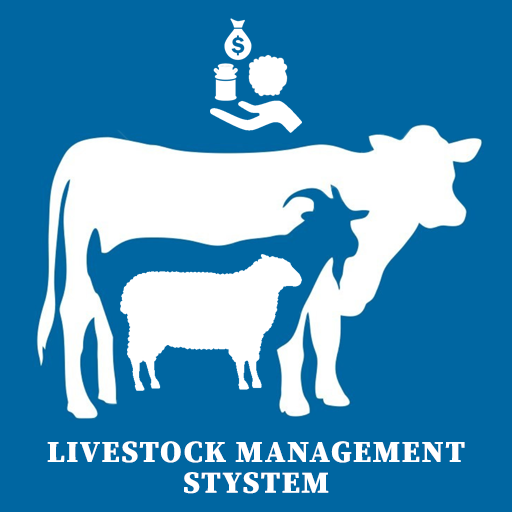

<!-- PROJECT LOGO -->
 

  

<h3 align="center">LMS GUI App</h3>

  

    The Livestock Management System is a project that I developed as part of a school 
    assignment. It is a user-friendly application designed to assist livestock owners and 
    managers in efficiently managing and maintaining data for various types of livestock. A console equivalant can be found <a href="https://github.com/Tipzilla/LMS-Console-App">here</a>.
     
    <a href="https://github.com/Tipzilla/LMS-GUI-App"><strong>Explore the docs »</strong></a>
     
     
    <a href="https://github.com/Tipzilla/LMS-GUI-App/issues">Report Bug</a>
    <a href="https://github.com/Tipzilla/LMS-GUI-App/issues">Request Feature</a>
  

<!-- TABLE OF CONTENTS -->

  
Table of Contents

  <ol>
    <li><a href="#about-the-project">About The Project</a></li>
    <li><a href="#contact">Contact</a></li>
  </ol>

<!-- ABOUT THE PROJECT -->
## About The Project

<ul>
  <li>Graphical User Interface (GUI): The system provides a user-friendly interface that simplifies data entry and management tasks.</li>
  <li>Data Management: Livestock data is stored and retrieved from a Microsoft Access Database, ensuring secure and organized record-keeping.</li>
  <li>Statistical Insights: The application goes beyond basic data management. It offers valuable statistics, such as calculating total income 
      generated by each livestock type, counting livestock of specific colors, and determining average weight based on user-defined thresholds.</li>
  <li>User-Friendly: The project is designed with user convenience in mind, making it accessible to individuals with varying levels of technical expertise.
      Additionally, it includes robust error checks to ensure that data is entered correctly. If any issues arise during data input, users are promptly notified, providing a seamless and error-free experience.
  </li>
</ul>

(<a href="#readme-top">back to top</a>)

<!-- CONTACT -->
## Contact

Hamish Getty - [LinkedIn](https://www.linkedin.com/in/hamish-getty-596894269/)

Project Link: [https://github.com/Tipzilla/LMS-GUI-App](https://github.com/Tipzilla/LMS-GUI-App)

(<a href="#readme-top">back to top</a>)
